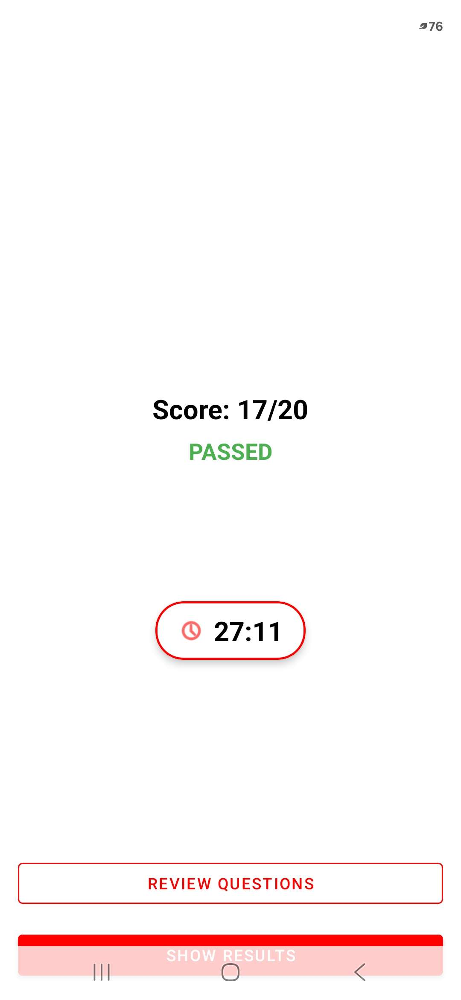

# Canadian Citizenship App 🇨🇦

An Android app that helps users prepare for the Canadian Citizenship Test through study materials, chapter quizzes, and mock exams.

## 🚧 Project Status

This project is still a work in progress and is **not ready for Google Play Store release yet**.

The core functionality is working, but there are still improvements planned before public release, including accessibility improvements, additional testing, release optimization, and Play Store requirements.

## Screenshots

<p align="center">
  
  
  
  
  
  
</p>

## Features

- 📚 Study guide based on 12 citizenship chapters
- 🔍 Search study materials
- ⭐ Save favorite chapters
- 📝 Chapter quizzes
- ⏱️ Timed practice and mock exams
- ✅ Review answers after completing exams
- 📊 Progress tracking
- 🌙 Light and Dark Mode support
- 💾 Offline functionality

## Tech Stack

| Category | Technology |
|-----------|------------|
| Language | Java |
| UI Framework | Android SDK, XML Layouts, Material Design Components |
| Architecture | MVVM, Repository Pattern |
| Database | Room Database (SQLite) |
| Storage | SharedPreferences |
| UI Components | RecyclerView, ViewBinding, Activities |
| Build Tools | Android Studio, Gradle |
| Version Control | Git, GitHub |

## ⚙️ Installation

1. Clone this repository.

```bash
git clone https://github.com/veuy/Canadiancitizenshipapp.git
```

2. Open the project in Android Studio (Ladybug or newer recommended).

3. Build and run on an Android device or emulator (Target SDK 35).

## Planned Improvements

- [ ] Privacy Policy
- [ ] Government Disclaimer
- [ ] Accessibility improvements
- [ ] Automated testing
- [ ] Release build optimization
- [ ] Enhanced progress statistics
- [ ] Google Play Store release preparation

## Disclaimer

This application is an independent educational project and is not affiliated with, endorsed by, or sponsored by Immigration, Refugees and Citizenship Canada (IRCC) or the Government of Canada.

## Author

**Vincent Ely Uy**

GitHub: https://github.com/veuy
